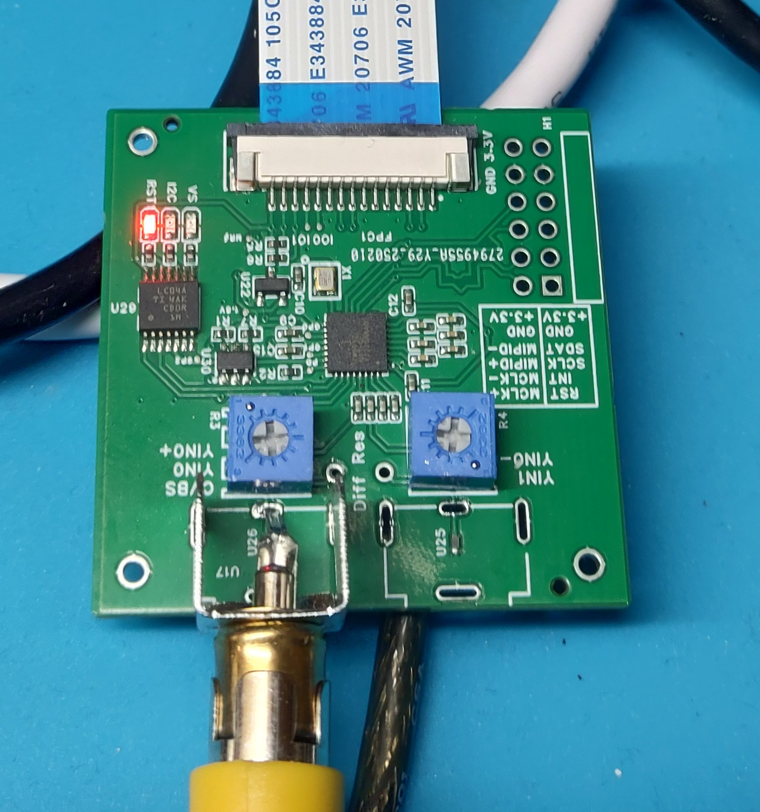
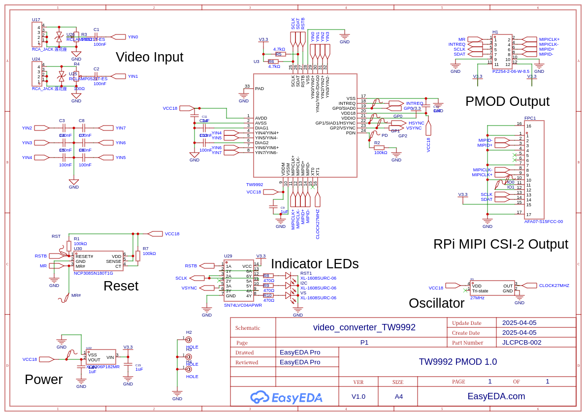

# tw9992-linux
Linux driver for Renesas TW9992

The TW9992 is a low Power NTSC/PAL Video Decoder with Differential CVBS Inputs and
MIPI-CSI2 Output Interface.

It can be connected to Raspberry Pi camera interface or other MIPI-CSI2 receiver.

Example module for Raspberry Pi:

 
An EasyEDA project can be found in https://oshwlab.com/jarkko.sonninen/tw9992-pmod-1-0
