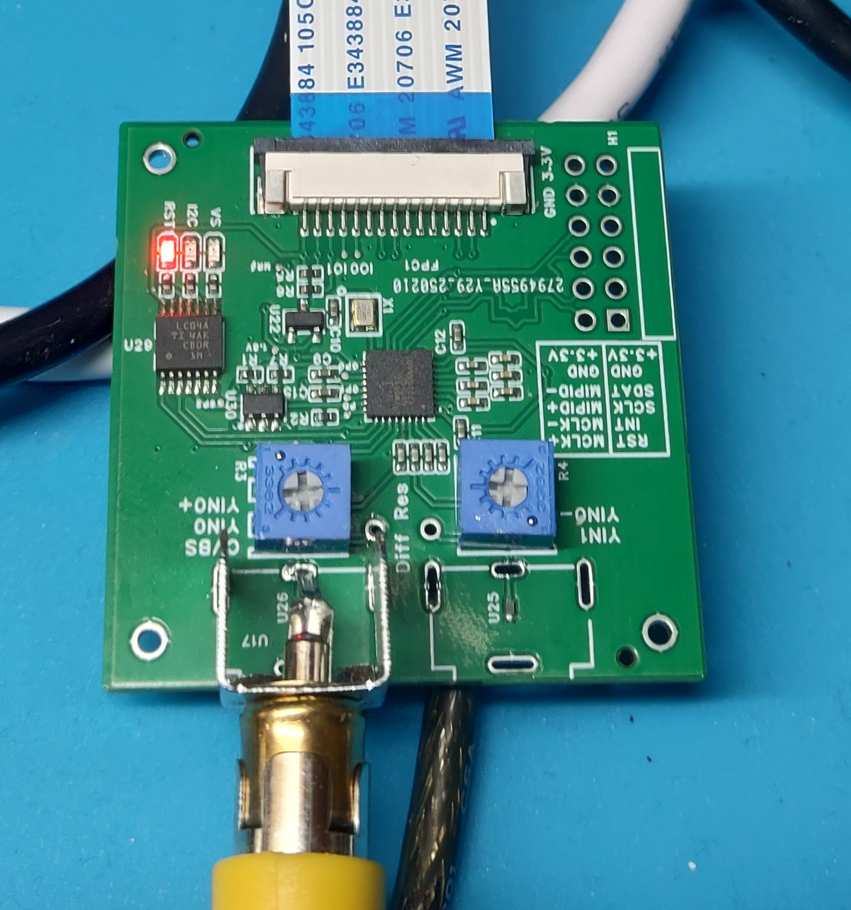
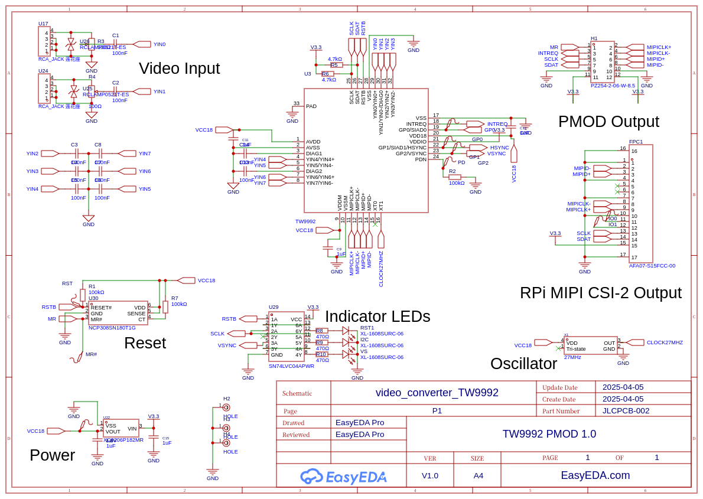

# tw9992-linux
Linux driver for Renesas TW9992

The 

 is a low Power NTSC/PAL Video Decoder with Differential CVBS Inputs and
MIPI-CSI2 Output Interface.

It can be connected to Raspberry Pi camera interface or other MIPI-CSI2 receiver.

To compile and install:
```
cd driver
make crash
```

There is a test program in src/fb.c. It works on console framebuffer. Just `gcc fb.c` and `./a.out`

There are special v4l controls "setaddr", "getreg" and "setreg". You can use them to peek and poke i2c registers. For example get value of register 3

```
v4l2-ctl -c setaddr=0x03; v4l2-ctl -C getreg | sed 's/getreg:/obase=2;/' | bc
1101001
```
Register 3 bits:
| 7 VDLOSS R | 1 = Video not present. (Sync is not detected in number of line periods specified by MISSCNT register) |
| | 0 = Video detected. |
| 6 HLOCK R | 1 = Horizontal sync PLL is locked to the incoming video source. |
| | 0 = Horizontal sync PLL is not locked.
| 5 SLOCK R | 1 = Subcarrier PLL is locked to the incoming video source. |
| | 0 = Subcarrier PLL is not locked. |
| 4 FIELD R | 1 = Even field is being decoded. |
| | 0 = Odd field is being decoded. |
| 3 VLOCK R | 1 = Vertical logic is locked to the incoming video source. |
| | 0 = Vertical logic is not locked. |
| 2 Reserved R | Reserved - |
| 1 MONO R | 1 = No color burst signal detected. |
| | 0 = Color burst signal detected. |
| 0 DET50 R | 0 = 60Hz source detected |
| | 1 = 50Hz source detected |
For register info, get the datasheet.

Example module for Raspberry Pi:





An EasyEDA project can be found in https://oshwlab.com/jarkko.sonninen/tw9992-pmod-1-0
